# 🏗️ Designing smart apartment step by step

I'm not a smart home expert. I've just started renovating a new apartment.
I'm planning automation right into the foundation.
I want to use Shelly devices to make this place smarter, safer, and more comfortable - room by room.
This is my step-by-step vision: from empty rooms to an intelligent, secure, and comfortable living space.

---

## 🏠 Apartment Layout

- **Living room with kitchen** - 45 m², no exterior windows
- **Home office** - 26 m², 1 window + balcony door
- **Conference room** - 16 m², 1 window
- **Bathroom** - 8 m², 1 window
- **Guest room** - 9 m², 1 window
- **Master bedroom** - 17 m², 1 window

All rooms are connected with internal doors (some glass, some standard).
The apartment includes both privacy areas and shared zones - perfect for tailored automations.
Each room will be equipped with Shelly devices tailored to its purpose. The goal: combine comfort, energy efficiency, and security - without overcomplicating things.

---

## 💡 Phase 1: Smart Lighting & Power
- **Shelly Duo GU10** smart bulbs in ceilings for flexible lighting scenes in every room
- **Shelly Plug S Gen3** in selected sockets for real-time energy monitoring and remote power control (e.g. fans, lamps, chargers)

---

## 🚪 Phase 2: Security & Entry
- **Shelly BLU Door/Window Sensors** on all windows and internal doors to track open/closed states and trigger smart scenes
- **LOQED Touch Smart Lock** for secure, keyless front door access

---

## 🌡️ Phase 3: Heating & Comfort
- **Shelly BLU TRV** smart thermostatic radiator valves for per-room temperature control
- **Shelly H&T** in the bathroom to monitor temperature and humidity
- **Shelly Flood** near the bathroom entrance to detect water leaks early and trigger alerts or automation

---

## 👁️ Phase 4: Presence & Safety
- **Shelly BLU Motion** sensors on ceilings across all rooms to automate lighting and detect presence
- **Shelly Plus Smoke Alarm** above the kitchen area to catch smoke early and ensure safety

---

## 🧰 Planned Devices

Each room will feature a blend of Shelly devices based on use case:

- [**Shelly Duo GU10**](https://www.shelly.com/products/shelly-duo-rgbw-gu10) – smart lighting
- [**Shelly Plug S Gen3**](https://www.shelly.com/products/shelly-plug-s-gen3-1) – socket automation
- [**Shelly BLU TRV**](https://www.shelly.com/products/shelly-blu-trv-single-pack) – radiator thermostat
- [**Shelly H&T**](https://www.shelly.com/products/shelly-h-t-white) – temperature & humidity monitor
- [**Shelly Flood**](https://www.shelly.com/products/shelly-flood) – water leak detection
- [**Shelly BLU Door/Window**](https://www.shelly.com/products/shelly-blu-door-window-black) – open/close state detection
- [**Shelly BLU Motion**](https://www.shelly.com/products/shelly-blu-motion) – motion detection
- [**Shelly Plus Smoke Alarm**](https://www.shelly.com/products/shelly-plus-smoke-alarm) – smoke detection
- [**LOQED Touch Smart Lock**](https://www.shelly.com/products/loqed-touch-smart-lock-black) – smart door access (complemented by Shelly logic)

---

## 🔁 Automations (Logic Flow)

Here's how Shelly devices will automate everyday routines in the apartment:

---

### 💡 1. Motion-based Lighting (Guest Room)

**Trigger:** Motion detected by Shelly BLU Motion

**Condition:** After sunset

**Action:** Turn on Shelly Duo GU10 for 10 minutes

---

### 🚪 2. Door Monitoring & Notification

**Trigger:** Shelly BLU Door/Window sensor detects front door opened

**Condition:** Between 00:00-06:00

**Action:** Send mobile notification: "Front door opened at night"

```mermaid
flowchart TD
    DoorOpen[Front door opened]
    TimeCheck[Between 00:00–06:00]
    IsNight{Is it night?}
    Notify[Send mobile notification: 'Front door opened at night']
    NoAction[Do nothing]

    DoorOpen --> IsNight
    TimeCheck --> IsNight
    IsNight -->|Yes| Notify
    IsNight -->|No| NoAction
```

---

### 🌡️ 3. Bathroom Comfort Automation

**Trigger:** Humidity > 70% detected by Shelly H&T

**Condition:** Any time

**Action:** Turn on smart fan via Shelly Plug S (automatically turn off after 20 minutes)

---

### 🔥 4. Kitchen Fire Safety
**Trigger:** Smoke detected by Shelly Plus Smoke Alarm

**Condition:** Any time

**Action:**
- Turn on all lights via Shelly Duo GU10
- Send high-priority mobile alert
- Turn off power to kitchen sockets via Shelly Plug S (optional)

---

### 🔒 5. Window Left Open Warning (Winter)

**Trigger:** Shelly BLU Door/Window detects window open

**Condition:** Outside temperature < 10°C

**Action:** Send notification: "Window open while cold outside"

---

### 🛏️ 6. Night Mode in Master Bedroom

**Trigger:** Motion detected between 22:00-06:00

**Condition:** Only in master bedroom

**Action:** Turn on Shelly Duo GU10 at 15% brightness for 3 minutes

```mermaid
flowchart TD
    Motion[Motion detected in master bedroom]
    TimeCheck[Between 22:00–06:00]
    IsNight{Is it night time?}
    LightOn[Turn on Shelly Duo GU10 at 15% for 3 minutes]
    NoAction[Do nothing]

    Motion --> IsNight
    TimeCheck --> IsNight
    IsNight -->|Yes| LightOn
    IsNight -->|No| NoAction
```

---

### 🌡️ 7. Heating Optimization

**Trigger:** Room temperature < 19°C detected by Shelly H&T

**Condition:** Between 06:00-23:00

**Action:** Open Shelly BLU TRV radiator valve until 21°C is reached

```mermaid
flowchart TD
    TempLow[Temperature below 19°C - Shelly HT]
    TimeRange[Between 06:00–23:00]
    IsDaytime{Is it daytime?}
    HeatOn[Open Shelly BLU TRV until 21°C is reached]
    NoAction[Do nothing]

    TempLow --> IsDaytime
    TimeRange --> IsDaytime
    IsDaytime -->|Yes| HeatOn
    IsDaytime -->|No| NoAction
```

---

These automations are just the starting point.
With Shelly's open ecosystem, I can expand logic flows and combine devices over time - no cloud lock-in, no limits.

---

🏁 *Project still in early stage, but every decision now is shaping the smart future of this space.*

---

### 🧠 Why Shelly?
Shelly gives me a flexible, local-first smart home ecosystem I can build up over time.
It fits perfectly with my approach: **think ahead, wire smart, automate gradually**.

Even though I don't yet own the devices, I'm planning every detail now - so my renovation doesn't block smart upgrades later.

---

From blueprint to behavior — this apartment is being built with intent, not guesswork.
Step by step. Room by room. Powered by Shelly and a bit of obsession.

